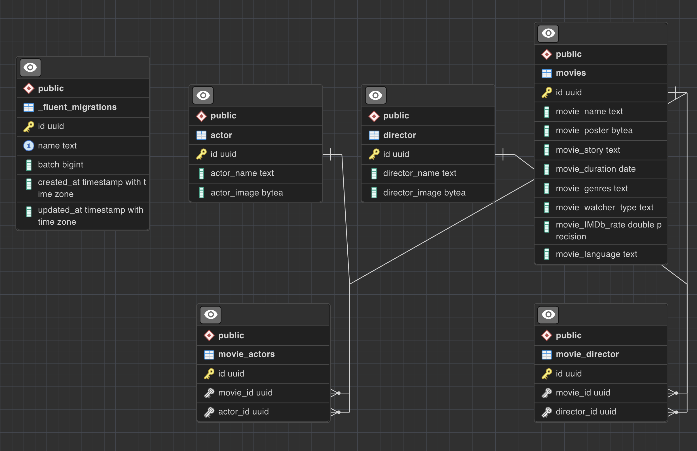

# 🎥 MoviesAPI
### A Movies API created using Vapor, Fluent (ORM) and Postgres.

### You can use this project if you want to build a local movie API that views all movies and their directors and actors as well as adding and deleting more movies.
### What you need to do :
1.  Instal [Swift and Vapor Toolbox](https://docs.vapor.codes/install/macos/) 
2. Create your Postgres Database
3. Clone this project via xcode
4. Replace your database configuration in the [configure.swift](https://docs.vapor.codes/fluent/overview/#postgresql)
5. Run your project and migrate your database, by [running](https://docs.vapor.codes/fluent/overview/#migrate) the migrate command in terminal.
  > You can also run this command through Xcode. The migrate command will check the database to see if any new migrations have been registered since it was last run. If there are new migrations, it will ask for a confirmation before running them.
- The database schema look like this:

6. Run your project again to start using your server👏🏼

### API End pointes 

| Method   | URL                                      | Description                              |
| -------- | ---------------------------------------- | ---------------------------------------- |
| `GET`    | `/movies`                             | Retrieve all movies.                      |
| `GET`   | `/movies/id`                             |  Retrieve specific movie by id.                       |
| `POST`    | `/movies`                          | Add movie.                       |
| `GET`  | `/actor`                          | Retrieve all actors.                 |
| `GET`   | `/actor/movieId`                             |  Retrieve specific actors by id.                       |
| `POST`  | `/actor`                          | Add actor.                 |
| `GET`  | `/director`                          | Retrieve all director.                 |
| `GET`   | `/director/movieId`                             |  Retrieve specific directors by id.                       |
| `POST`  | `/director`                          | Add director.                 |

